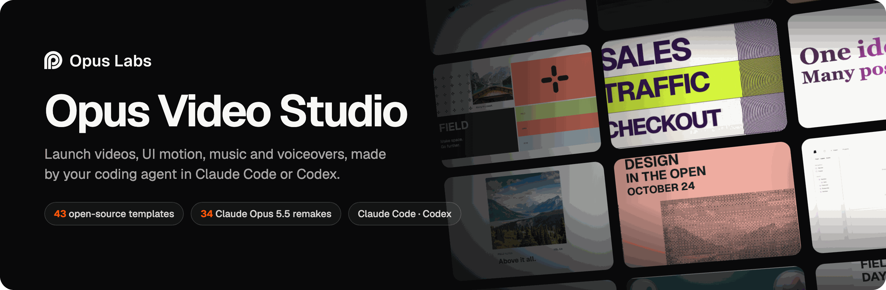
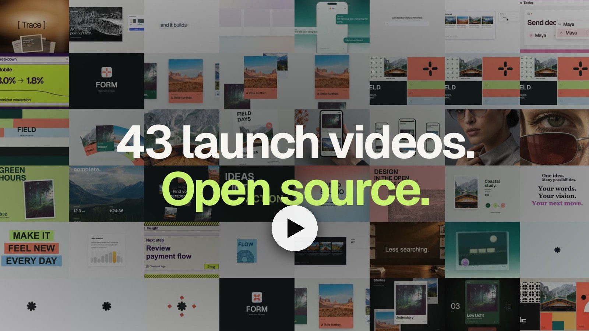
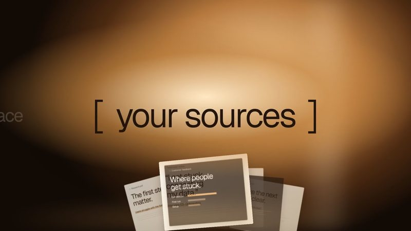
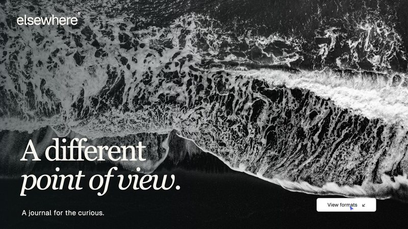
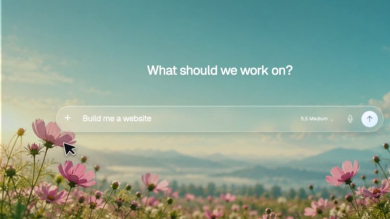
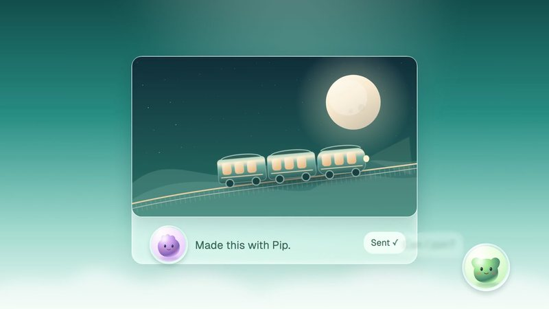
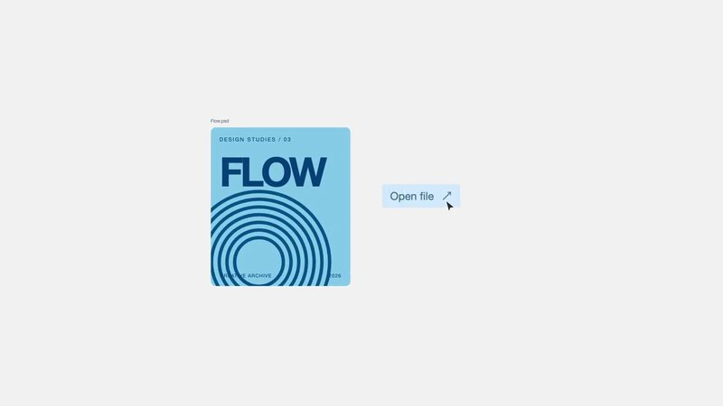
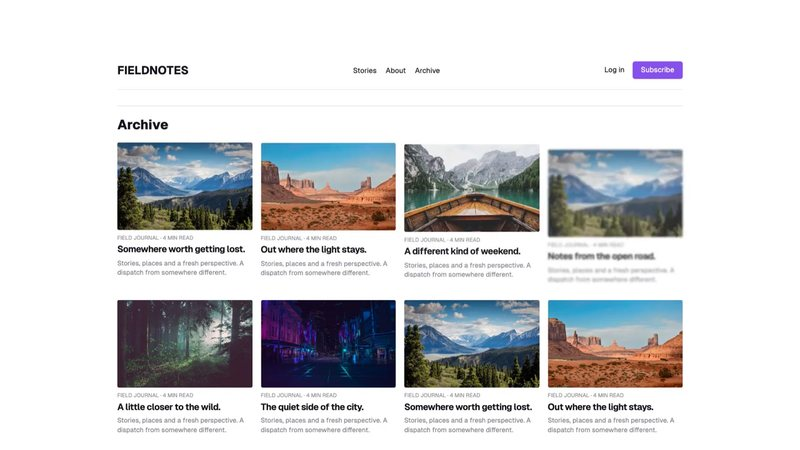
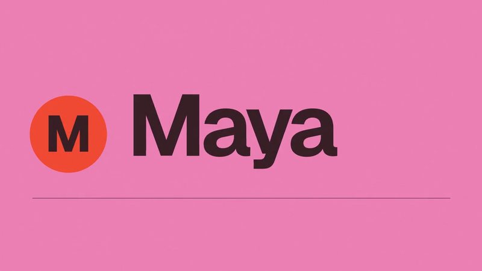

<p align="center">
  <a href="https://labs.opus.pro"></a>
</p>

<p align="center">
  <a href="#quick-start"></a> <a href="#quick-start"></a> <a href="templates/README.md"></a> <a href="remakes/opus-5.5/README.md"></a> <a href="templates/LICENSE"></a>
</p>

<p align="center">
  <a href="https://labs.opus.pro"><b>labs.opus.pro</b></a> ·
  <a href="https://product-videos.labs.opus.pro/">Template gallery</a> ·
  <a href="#quick-start">Quick start</a> ·
  <a href="#for-ai-agents">For AI agents</a> ·
  <a href="remakes/opus-5.5/README.md">GPT-6 vs Claude Opus 5.5</a>
</p>

Opus Video Studio is a plugin for **Claude Code** and **Codex** that turns your coding agent into a video studio.
Start from one of **43 open-source Remotion templates**, and your agent adapts the original source to your product
and renders it on your machine. Voiceover, music, images and AI video clips come from the managed
Opus Video Tools connection.

<p align="center">
  <a href="https://opus-lab.cdn.opuslab.ai/labs/launch-videos/opus-5.5/v1/launch-film/r2/launch-film-16x9.mp4"></a><br>
  <sub><b>The launch film</b>, 45 seconds. Claude Opus 5.5 made it with this plugin: every clip comes from this repository. · <a href="https://opus-lab.cdn.opuslab.ai/labs/launch-videos/opus-5.5/v1/launch-film/r2/launch-film-9x16.mp4">Vertical cut</a></sub>
</p>

## Quick start

**1. Install the plugin.** In **Claude Code**, in a terminal session or the Desktop Code tab:

```text
/plugin marketplace add opus-pro/opus-video-studio
/plugin install opus-video-studio@opus-pro
```

In **Codex**:

```sh
codex plugin marketplace add https://github.com/opus-pro/opus-video-studio.git --ref main
codex plugin add opus-video-studio@opus-pro
```

Then start a new session so the skills load. The [Claude Code](docs/claude-code-install-protocol.md) and
[Codex](docs/codex-install-protocol.md) guides cover upgrades, Desktop, and signing in to the managed tools.

**2. Ask for a video.** Pick a template in the [gallery](https://product-videos.labs.opus.pro/) or [below](#templates), then say what you want:

```text
Make a 20-second launch video for Acme (acme.com) from https://labs.opus.pro/product-videos/ai-research
```

```text
Turn https://labs.opus.pro/product-videos/pf-mark-lockup into a 4-second logo reveal. Logo: ./brand/logo.svg
```

```text
Write and generate a 30-second music bed for our product demo
```

Your agent downloads the template's original source and verifies its SHA-256, swaps in your copy, logo and colors,
renders a baseline and the final MP4 locally, and reviews every transition. Local templates and rendering are free and
need no Opus account. Generated media, such as the music bed in the last example, needs an Opus account and credits,
and the agent always shows you the exact request before it spends any.

**3. Or skip the plugin.** Every template is plain Remotion source:

```sh
git clone https://github.com/opus-pro/opus-video-studio.git && cd opus-video-studio
npm run templates:prepare -- ai-research      # restores this template's media, verified by SHA-256
cd templates/ai-research/project && npm ci && npm run studio   # or: npm run render
```

## For AI agents

If you are an agent working in this repository or helping a user with it, read [`AGENTS.md`](AGENTS.md) first. In short:

- **To install for a user**, follow the protocol for your client:
  [Claude Code](docs/claude-code-install-protocol.md) or [Codex](docs/codex-install-protocol.md).
  Don't treat a checkout as an installed plugin; the skills resolve their plugin root from the installed path.
- **When given a template link** (`https://labs.opus.pro/product-videos/<id>`), use the `motion-ui` skill and the
  [source workflow](plugins/opus-video-studio/docs/template-source.md). Download and verify the original project and edit it.
  Never rebuild it from the preview video.
- **The catalogues are machine-readable:** [`templates/catalog.json`](templates/catalog.json) and
  [`remakes/opus-5.5/catalog.json`](remakes/opus-5.5/catalog.json) give ids, sizes, demos and file checksums.
- **Local rendering is free.** Paid generation needs the user's approval of the exact request, as set out in the
  [shared rules](plugins/opus-video-studio/docs/shared-rules.md).
- **Never commit restored media.** Files recorded as `"storage": "download"` stay out of Git. Run `npm test` before committing.

A user can hand their agent one line:

```text
Install Opus Video Studio by following https://github.com/opus-pro/opus-video-studio/blob/main/docs/claude-code-install-protocol.md, then help me make a launch video.
```

For Codex, swap in `codex-install-protocol.md`.

## Templates

**9 full launch films and 34 motion components**, all editable source under the [MIT License](templates/LICENSE).
Each keeps its original animation code, configuration, locked dependencies and asset notes. Click a poster to watch it.

<table>
<tr>
<td width="33%" valign="top"><a href="https://opus-lab.cdn.opuslab.ai/labs/launch-videos/lite/ai-research-motion-template-lite-v5-1.0.0/preview.mp4"></a><br><b><a href="templates/ai-research/">AI Research Assistant</a></b><br><sub>Research and evidence workflows · 19 s</sub></td>
<td width="33%" valign="top"><a href="https://opus-lab.cdn.opuslab.ai/labs/launch-videos/lite/margin-motion-template-lite-fast20-1.0.0/preview.mp4"></a><br><b><a href="templates/margin/">AI Writing Assistant</a></b><br><sub>Writing and document workflows · 20 s</sub></td>
<td width="33%" valign="top"><a href="https://opus-lab.cdn.opuslab.ai/labs/launch-videos/lite/aiagent-motion-template-lite-1.0.0/preview.mp4"></a><br><b><a href="templates/aiagent/">AI Coding Agent</a></b><br><sub>AI coding agents and software creation workflows · 28 s</sub></td>
</tr>
<tr>
<td width="33%" valign="top"><a href="https://opus-lab.cdn.opuslab.ai/labs/launch-videos/lite/agent-opus-motion-template-lite-v19.10-1.1.0/preview.mp4"></a><br><b><a href="templates/agent-opus/">AI Video Generator</a></b><br><sub>AI video creation · 41 s</sub></td>
<td width="33%" valign="top"><a href="https://opus-lab.cdn.opuslab.ai/labs/launch-videos/lite/ai-companion-motion-template-lite-v12-1.0.0/preview.mp4"></a><br><b><a href="templates/ai-companion/">AI Companion</a></b><br><sub>Character chat and personal assistants · 30 s</sub></td>
<td width="33%" valign="top"><a href="https://opus-lab.cdn.opuslab.ai/labs/launch-videos/lite/creative-search-motion-template-lite-v8-1.0.0/preview.mp4"></a><br><b><a href="templates/creative-search/">Creative Search</a></b><br><sub>Creative file search · 23 s</sub></td>
</tr>
<tr>
<td width="33%" valign="top"><a href="https://opus-lab.cdn.opuslab.ai/labs/launch-videos/lite/website-builder-motion-template-lite-v3-1.0.0/preview.mp4"></a><br><b><a href="templates/website-builder/">Website Builder</a></b><br><sub>Website and visual editors · 52 s</sub></td>
<td width="33%" valign="top"><a href="https://opus-lab.cdn.opuslab.ai/labs/launch-videos/lite/tovo-motion-template-lite-1.0.0/preview.mp4"></a><br><b><a href="templates/tovo/">AI Meeting Assistant</a></b><br><sub>Meeting notes and action items · 15 s</sub></td>
<td width="33%" valign="top"><a href="https://opus-lab.cdn.opuslab.ai/labs/launch-videos/lite/numo-motion-template-lite-1.0.0/preview.mp4"></a><br><b><a href="templates/numo/">Analytics Dashboard</a></b><br><sub>Data analytics · 15 s</sub></td>
</tr>
</table>

<p align="center"><a href="templates/README.md"><b>Browse all 43 templates and components →</b></a></p>

## GPT-6 vs Claude Opus 5.5

The 34 motion components were originally built with GPT-6 and refined through human review. **Claude Opus 5.5 remade
every one of them blind.** It got only the written spec, the same assets and an empty Remotion project, and it worked in one pass
without seeing the original or getting any feedback. Each remake keeps its prompt (`TASK.md`) and the model's own
`BUILD-LOG.md`. Click a pair to play it side by side.

<table>
<tr>
<td width="50%" valign="top"><a href="https://opus-lab.cdn.opuslab.ai/labs/launch-videos/opus-5.5/v1/pf-brand-clover/compare.mp4"></a><br><b><a href="remakes/opus-5.5/pf-brand-clover/">Logo Unfold Brand System</a></b><br><sub>GPT-6 original · Claude Opus 5.5 remake · precise spec</sub></td>
<td width="50%" valign="top"><a href="https://opus-lab.cdn.opuslab.ai/labs/launch-videos/opus-5.5/v1/template-manifesto/compare.mp4"></a><br><b><a href="remakes/opus-5.5/template-manifesto/">Glossy Serif Manifesto</a></b><br><sub>GPT-6 original · Claude Opus 5.5 remake · one-paragraph brief</sub></td>
</tr>
<tr>
<td width="50%" valign="top"><a href="https://opus-lab.cdn.opuslab.ai/labs/launch-videos/opus-5.5/v1/pf-carousel-vertical/compare.mp4"></a><br><b><a href="remakes/opus-5.5/pf-carousel-vertical/">Vertical Portfolio Relay</a></b><br><sub>GPT-6 original · Claude Opus 5.5 remake · precise spec</sub></td>
<td width="50%" valign="top"><a href="https://opus-lab.cdn.opuslab.ai/labs/launch-videos/opus-5.5/v1/pf-orbit-focus/compare.mp4"></a><br><b><a href="remakes/opus-5.5/pf-orbit-focus/">3D Orbit to Hero</a></b><br><sub>GPT-6 original · Claude Opus 5.5 remake · precise spec</sub></td>
</tr>
</table>

<p align="center"><a href="remakes/opus-5.5/README.md"><b>See all 34 comparisons and the protocol →</b></a></p>

```sh
npm run remakes:prepare -- pf-brand-clover    # the same verified media as the original release
cd remakes/opus-5.5/pf-brand-clover/project && npm ci && npm run studio
```

## What's in the plugin

| | |
|---|---|
| [**Get started**](plugins/opus-video-studio/skills/get-started/SKILL.md) | Choose a template or generated media. Browse the [template library](https://product-videos.labs.opus.pro/) or start from the [open-source templates](templates/). |
| [**Motion UI**](plugins/opus-video-studio/skills/motion-ui/SKILL.md) | Editable UI animation and code-driven product videos, with real-UI fidelity, kinetic typography, deliberate easing, and optional Opus audio. |
| [**Media Tools**](plugins/opus-video-studio/skills/media-tools/SKILL.md) | Standalone audio, images and keyframes, transcription, asset import, and job status and recovery. |
| [**Video Director**](plugins/opus-video-studio/skills/video-director/SKILL.md) | Directing and prompt optimization for every new AI video generation, including direct model requests. It supports whichever video models the public tools expose; the bundled Seedance pack is loaded only for Seedance. |
| **Opus Video Tools MCP** | The managed `opus-video-tools` connection at `https://labs.opus.pro/opus-video-tools/mcp`. |
| **Local Remotion** | Pinned local Remotion dependencies, a setup helper, and an editable starter composition. |

Video Director planning and the complete timed script apply to managed video clips. Local
animation and code-generated video use the chosen framework; standalone media calls review the
requested text, audio brief, or image prompt without a video storyboard. Paid generation still
requires approval of the exact request. The plugin
tracks asynchronous jobs and reuses request keys for identical retries. It contains no provider
credentials or backend service implementation.

The repository is public; managed generation still requires an authorized Opus account,
product access, and sufficient credits. Installing the plugin does not grant service access.
Local Remotion setup and preview do not spend Opus generation credits.

## Install guides

- [Codex installation guide](docs/codex-install-protocol.md)
- [Claude Code installation guide](docs/claude-code-install-protocol.md)
- [Publishing and verifying the shared website guides](docs/guide-publication.md)

The Product Videos website currently offers Codex onboarding. The plugin keeps
both client distributions and shares its source-template and media workflows.

<details>
<summary><b>For maintainers</b>: names and validation</summary>

### Names

| Setting | Value | Defined in |
|---|---|---|
| Public repository | `opus-pro/opus-video-studio` | GitHub and installation guides |
| Display name | `Opus Video Studio` | Codex plugin manifest |
| Plugin installation ID | `opus-video-studio@opus-pro` | Codex and Claude marketplace manifests |
| MCP server ID | `opus-video-tools` (the managed Opus Video Tools connection) | Plugin `.mcp.json` |

The installation ID is stable so existing clients can upgrade. Repository names, plugin IDs,
display names, and OAuth resource addresses are separate settings.

### Validate

Run `npm test` with Node.js 22 or newer. These local checks do not prove live OAuth, generation,
or billing availability. The installation guides include connection checks.

</details>

## License

Opus-authored template source and tooling in [`templates/`](templates/) and the
remake source in [`remakes/`](remakes/) are [MIT licensed](templates/LICENSE). Media, fonts,
trademarks, and dependencies retain their own terms; see the
[asset notices](templates/THIRD_PARTY_NOTICES.md).
The plugin outside `templates/` and `remakes/` retains its existing proprietary license designation.

---

<p align="center">
  <a href="https://labs.opus.pro">
    <picture>
      <source media="(prefers-color-scheme: dark)" srcset=".github/assets/opus-labs-wordmark-white.svg">
      
    </picture>
  </a><br>
  <sub>Built by <a href="https://labs.opus.pro">Opus Labs</a> at <a href="https://www.opus.pro">OpusClip</a>.</sub>
</p>
