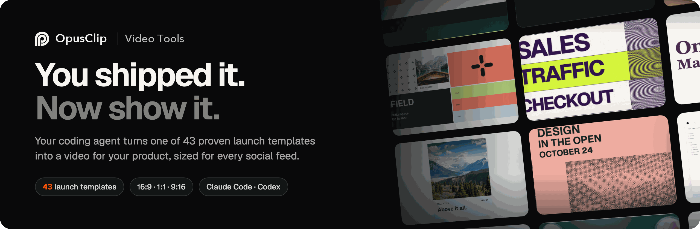
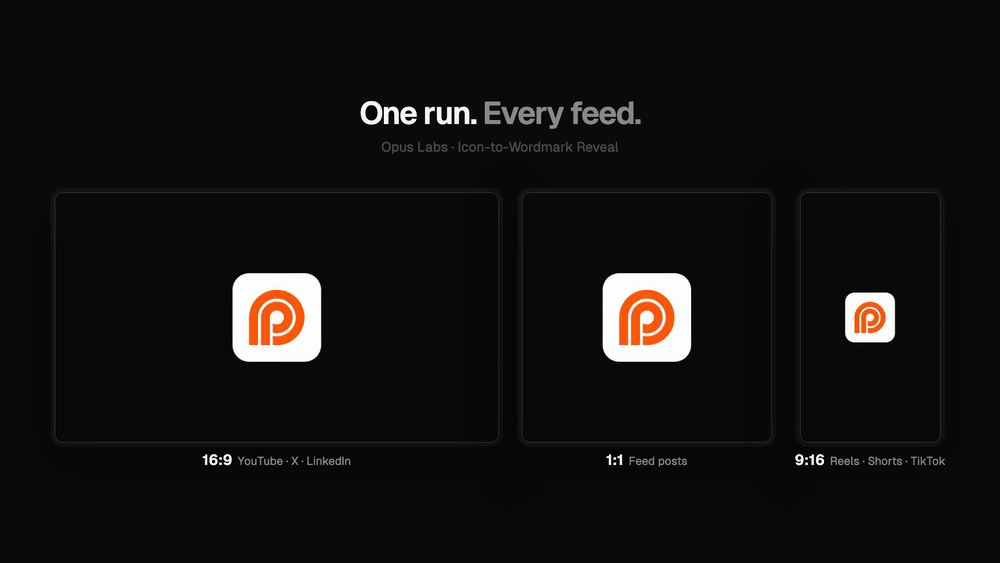

<p align="center">
  <a href="https://www.opus.pro/?utm_source=github&utm_medium=readme&utm_campaign=opusclip-video-tools&utm_content=banner"></a>
</p>

<p align="center">
  <a href="https://www.opus.pro/?utm_source=github&utm_medium=readme&utm_campaign=opusclip-video-tools&utm_content=badge"></a> <a href="#quick-start"></a> <a href="#quick-start"></a> <a href="templates/README.md"></a> <a href="templates/LICENSE"></a>
</p>

<p align="center">
  <a href="https://www.opus.pro/?utm_source=github&utm_medium=readme&utm_campaign=opusclip-video-tools&utm_content=nav"><b>OpusClip</b></a> ·
  <a href="https://labs.opus.pro">Opus Labs</a> ·
  <a href="https://product-videos.labs.opus.pro/">Template gallery</a> ·
  <a href="#quick-start">Quick start</a> ·
  <a href="#get-the-best-results">Best results</a> ·
  <a href="#for-ai-agents">For AI agents</a>
</p>

**Everyone knows a launch should go out on social. The hard part is making the video.** OpusClip Video Tools turns
**Claude** and **ChatGPT** into your motion designer. Tell it what you shipped, and it hands back a finished video for
every feed, built from templates that already work. It runs as a plugin for Claude Code and Codex, with MIT-licensed template and remake source,
made by [Opus Labs](https://labs.opus.pro), brought to you by [OpusClip](https://www.opus.pro/?utm_source=github&utm_medium=readme&utm_campaign=opusclip-video-tools&utm_content=intro).

<table>
<tr>
<td width="50%" valign="top"><b>"I built a great product, but I don't know how to market it."</b><br><sub>For builders. You don't need a video team or editing skills. Tell your agent about your product, and it turns a proven launch template into a video with your logo, screens and colors.</sub></td>
<td width="50%" valign="top"><b>"My team ships new features every week. I need a way to tell customers about all of them."</b><br><sub>For marketers. Make a video for every release without waiting on design. Ask in the Claude or ChatGPT app you already use, and reuse the same templates so every update looks on-brand.</sub></td>
</tr>
</table>

<p align="center">
  <a href="https://opus-lab.cdn.opuslab.ai/labs/launch-videos/opus-5.5/v1/launch-film/r5/launch-film-16x9.mp4"></a><br>
  <sub><b>Watch the 30-second launch film.</b> Every clip in it comes from these templates. · <a href="https://opus-lab.cdn.opuslab.ai/labs/launch-videos/opus-5.5/v1/launch-film/r5/launch-film-9x16.mp4">Vertical cut</a></sub>
</p>

<p align="center">
  <br>
  <sub>One prompt in. The agent downloads and verifies the template, adapts it to your brand, and renders every format you need. A real Claude Code session, sped up.</sub>
</p>

<table>
<tr>
<td width="33%" valign="top"><b>No video skills needed</b><br><sub>Describe the video in one sentence. Your agent edits the template's code, so there's no timeline to learn.</sub></td>
<td width="33%" valign="top"><b>Start from what already works</b><br><sub>9 full launch films and 34 ready-made pieces: logo reveals, headlines, showcases, product UI and data stories. Use one as is or mix them.</sub></td>
<td width="33%" valign="top"><b>Every feed from one run</b><br><sub>16:9 for X, YouTube and LinkedIn, 1:1 for feeds, and 9:16 for Reels, Shorts and TikTok. Rendered on your machine, free.</sub></td>
</tr>
</table>

## Quick start

**1. Install the plugin.** In **Claude Code** (terminal or the Code tab in Claude Desktop):

```text
/plugin marketplace add opus-pro/opusclip-video-tools
/plugin install opus-video-studio@opus-pro
```

In **Codex**:

```sh
codex plugin marketplace add https://github.com/opus-pro/opusclip-video-tools.git --ref main
codex plugin add opus-video-studio@opus-pro
```

Continue in the current conversation once the plugin is available. Use the client’s reload or Continue action when required; start a new conversation only if the client requires it, carrying the full brief forward. Need help with Desktop, upgrades or signing in? See the
[Claude Code](docs/claude-code-install-protocol.md) and [Codex](docs/codex-install-protocol.md) guides.

**2. Ask for a video.** Pick a template in the [gallery](https://product-videos.labs.opus.pro/) or [below](#pick-a-template-for-your-launch), then describe what you want:

```text
Make a 20-second launch video for Acme (acme.com) from https://product-videos.labs.opus.pro/ai-research, in 16:9 and 9:16
```

```text
Turn https://product-videos.labs.opus.pro/pf-mark-lockup into a 4-second logo reveal. Logo: ./brand/logo.svg
```

```text
Turn "Teams close tickets 3x faster with Acme" into a 10-second LinkedIn stat video from https://product-videos.labs.opus.pro/template-case-numo
```

That's it. Your agent adapts the template, renders it on your machine and checks the result before handing it back.

## Get the best results

What we've seen work, after making a lot of these:

- **Use the strongest model.** Set Claude Code to **Claude Opus 5.5** and Codex to **Astra 6**. Motion design takes
  a lot of taste and precision, and the top models get noticeably closer on the first try.
- **Start from a template, not a blank prompt.** The templates carry motion that's already been tuned. Pick the launch
  film closest to your product, or a single component if you only need a logo reveal or a headline.
- **Bring your real assets.** Your site URL, an SVG logo and two or three product screenshots. The agent uses only what
  you give it and never invents brand assets.
- **Keep it short.** 15 to 30 seconds for a launch, 4 to 6 for a logo reveal or a stat. Describe the whole video in one message.
- **Ask for every format at once.** 16:9 for X, YouTube and LinkedIn, 1:1 for feeds, 9:16 for Reels, Shorts and TikTok.
- **Revise like you'd brief a designer.** "Land the headline a beat earlier." "Use our dark palette." "Cut the second
  scene." The agent edits the video and re-renders.
- **Add music or voiceover last.** Templates and local rendering are free. AI-generated voiceover, music and footage
  run on paid models, so they use OpusClip credits to cover the cost. Your agent shows you the exact request first.

## Pick a template for your launch

Every template is editable source under the [MIT License](templates/LICENSE), with its original animation code,
locked dependencies and asset notes. Each preview plays inline; click it for the full video.

### Full launch films

Nine complete launch videos, each designed around a kind of product. Swap in your name, screens and colors.

<table>
<tr>
<td width="33%" valign="top"><a href="https://opus-lab.cdn.opuslab.ai/labs/launch-videos/lite/ai-research-motion-template-lite-v5-1.0.0/preview.mp4"></a><br><b><a href="templates/ai-research/">AI Research Assistant</a></b><br><sub>Research and evidence workflows · 19 s</sub></td>
<td width="33%" valign="top"><a href="https://opus-lab.cdn.opuslab.ai/labs/launch-videos/lite/margin-motion-template-lite-fast20-1.0.0/preview.mp4"></a><br><b><a href="templates/margin/">AI Writing Assistant</a></b><br><sub>Writing and document workflows · 20 s</sub></td>
<td width="33%" valign="top"><a href="https://opus-lab.cdn.opuslab.ai/labs/launch-videos/lite/aiagent-motion-template-lite-1.0.0/preview.mp4"></a><br><b><a href="templates/aiagent/">AI Coding Agent</a></b><br><sub>AI coding agents and software creation workflows · 28 s</sub></td>
</tr>
<tr>
<td width="33%" valign="top"><a href="https://opus-lab.cdn.opuslab.ai/labs/launch-videos/lite/agent-opus-motion-template-lite-v19.10-1.1.0/preview.mp4"></a><br><b><a href="templates/agent-opus/">AI Video Generator</a></b><br><sub>AI video creation · 41 s</sub></td>
<td width="33%" valign="top"><a href="https://opus-lab.cdn.opuslab.ai/labs/launch-videos/lite/ai-companion-motion-template-lite-v12-1.0.0/preview.mp4"></a><br><b><a href="templates/ai-companion/">AI Companion</a></b><br><sub>Character chat and personal assistants · 30 s</sub></td>
<td width="33%" valign="top"><a href="https://opus-lab.cdn.opuslab.ai/labs/launch-videos/lite/creative-search-motion-template-lite-v8-1.0.0/preview.mp4"></a><br><b><a href="templates/creative-search/">Creative Search</a></b><br><sub>Creative file search · 23 s</sub></td>
</tr>
<tr>
<td width="33%" valign="top"><a href="https://opus-lab.cdn.opuslab.ai/labs/launch-videos/lite/website-builder-motion-template-lite-v3-1.0.0/preview.mp4"></a><br><b><a href="templates/website-builder/">Website Builder</a></b><br><sub>Website and visual editors · 52 s</sub></td>
<td width="33%" valign="top"><a href="https://opus-lab.cdn.opuslab.ai/labs/launch-videos/lite/tovo-motion-template-lite-1.0.0/preview.mp4"></a><br><b><a href="templates/tovo/">AI Meeting Assistant</a></b><br><sub>Meeting notes and action items · 15 s</sub></td>
<td width="33%" valign="top"><a href="https://opus-lab.cdn.opuslab.ai/labs/launch-videos/lite/numo-motion-template-lite-1.0.0/preview.mp4"></a><br><b><a href="templates/numo/">Analytics Dashboard</a></b><br><sub>Data analytics · 15 s</sub></td>
</tr>
</table>

### Or grab just the piece you need

34 motion components, each split out as its own project, so you can drop a logo reveal into a video you already have
or string a few together into a new one.

<table>
<tr>
<td width="20%" valign="top"><a href="https://opus-lab.cdn.opuslab.ai/labs/launch-videos/lite/motion-component-pf-brand-clover-v1.0.0/preview.mp4"></a><br><b><a href="templates/README.md#brand-intros">Logo reveals</a></b><br><sub>9 brand intros</sub></td>
<td width="20%" valign="top"><a href="https://opus-lab.cdn.opuslab.ai/labs/launch-videos/lite/motion-component-template-ribbon-manifesto-v1.0.0/preview.mp4"></a><br><b><a href="templates/README.md#titles-and-announcements">Headlines</a></b><br><sub>6 titles and announcements</sub></td>
<td width="20%" valign="top"><a href="https://opus-lab.cdn.opuslab.ai/labs/launch-videos/lite/motion-component-pf-depth-swirl-v1.0.0/preview.mp4"></a><br><b><a href="templates/README.md#showcase-and-portfolio">Showcases</a></b><br><sub>9 galleries, 3D and portfolios</sub></td>
<td width="20%" valign="top"><a href="https://opus-lab.cdn.opuslab.ai/labs/launch-videos/lite/motion-component-pf-phone-carousel-v1.0.0/preview.mp4"></a><br><b><a href="templates/README.md#product-and-ui-demos">Product UI</a></b><br><sub>6 app and UI demos</sub></td>
<td width="20%" valign="top"><a href="https://opus-lab.cdn.opuslab.ai/labs/launch-videos/lite/motion-component-template-case-numo-v1.0.0/preview.mp4"></a><br><b><a href="templates/README.md#data-and-results">Data stories</a></b><br><sub>4 charts and results</sub></td>
</tr>
</table>

<p align="center"><a href="templates/README.md"><b>Browse all 43 templates and components →</b></a></p>

## What's in the plugin

| | |
|---|---|
| [**Get started**](plugins/opus-video-studio/skills/get-started/SKILL.md) | Choose a template or generated media. Browse the [template library](https://product-videos.labs.opus.pro/) or start from the [open-source templates](templates/). |
| [**Motion UI**](plugins/opus-video-studio/skills/motion-ui/SKILL.md) | Editable UI animation and code-driven product videos, with real-UI fidelity, kinetic typography, deliberate easing, and optional OpusClip audio. |
| [**Media Tools**](plugins/opus-video-studio/skills/media-tools/SKILL.md) | Standalone audio, images and keyframes, transcription, asset import, and job status and recovery. |
| [**Video Director**](plugins/opus-video-studio/skills/video-director/SKILL.md) | Directing and prompt optimization for every new AI video generation, including direct model requests. |
| **OpusClip Video Tools MCP** | The managed `opus-video-tools` connection at `https://labs.opus.pro/opus-video-tools/mcp`. |
| **Local Remotion** | Pinned local Remotion dependencies, a setup helper, and an editable starter composition. |

**What it costs.** Templates, preview and local rendering are free, with no account needed. AI-generated voiceover,
music, images and video run on paid models, so they use OpusClip credits to cover the cost. Credits come straight from
your OpusClip account, so there's nothing else to set up: [sign up or sign in at opus.pro](https://www.opus.pro/?utm_source=github&utm_medium=readme&utm_campaign=opusclip-video-tools&utm_content=pricing).
Your agent shows you the exact request and its cost before it spends anything.

<sub>Curious how models compare? Claude Opus 5.5 rebuilt all 34 components blind from a written spec.
[See the side-by-sides →](remakes/opus-5.5/README.md)</sub>

## Opus Labs, brought to you by OpusClip

<p>
  <a href="https://www.opus.pro/?utm_source=github&utm_medium=readme&utm_campaign=opusclip-video-tools&utm_content=about-logo">
    <picture>
      <source media="(prefers-color-scheme: dark)" srcset=".github/assets/opusclip-logo-white.png">
      
    </picture>
  </a>
</p>

[OpusClip](https://www.opus.pro/?utm_source=github&utm_medium=readme&utm_campaign=opusclip-video-tools&utm_content=about) is the AI video platform creators and brands use to turn long videos into short,
social-ready clips. [Opus Labs](https://labs.opus.pro) is where our team builds open-source video tools for AI agents,
and OpusClip Video Tools covers the other half of the job: making the launch video in the first place.

Your OpusClip account powers the AI features here, including voiceover, music, images and AI video, and it's where
your credits live.

<p align="center"><a href="https://www.opus.pro/?utm_source=github&utm_medium=readme&utm_campaign=opusclip-video-tools&utm_content=about-cta"><b>Create your OpusClip account →</b></a></p>

## For AI agents

If you are an agent helping a user with this repository, read [`AGENTS.md`](AGENTS.md) first. In short:

- **Install** by following the protocol for your client: [Claude Code](docs/claude-code-install-protocol.md) or
  [Codex](docs/codex-install-protocol.md). A checkout is not an installed plugin.
- **Route by skill:** [`motion-ui`](plugins/opus-video-studio/skills/motion-ui/SKILL.md) for templates and local
  animation, [`media-tools`](plugins/opus-video-studio/skills/media-tools/SKILL.md) for audio, images and transcription,
  [`video-director`](plugins/opus-video-studio/skills/video-director/SKILL.md) for AI video, and
  [`get-started`](plugins/opus-video-studio/skills/get-started/SKILL.md) when the user is unsure.
- **Given a template link** (`https://product-videos.labs.opus.pro/<id>`), follow the
  [source workflow](plugins/opus-video-studio/docs/template-source.md): download and verify the original project, then
  edit it. Never rebuild it from the preview video.
- **Catalogues are machine-readable:** [`templates/catalog.json`](templates/catalog.json) and
  [`remakes/opus-5.5/catalog.json`](remakes/opus-5.5/catalog.json).
- **Paid generation** needs the user's approval of the exact request; see the
  [shared rules](plugins/opus-video-studio/docs/shared-rules.md).

A user can hand their agent one line (for Codex, swap in `codex-install-protocol.md`):

```text
Install OpusClip Video Tools by following https://github.com/opus-pro/opusclip-video-tools/blob/main/docs/claude-code-install-protocol.md, then help me make a launch video.
```

Prefer plain Remotion? Every template runs without the plugin:

```sh
git clone https://github.com/opus-pro/opusclip-video-tools.git && cd opusclip-video-tools
npm run templates:prepare -- ai-research
cd templates/ai-research/project && npm ci && npm run studio   # or: npm run render
```

<details>
<summary><b>For maintainers</b>: names, website guides and validation</summary>

### Names

| Setting | Value | Defined in |
|---|---|---|
| Public repository | `opus-pro/opusclip-video-tools` | GitHub and installation guides |
| Display name | `OpusClip Video Tools` | Codex plugin manifest |
| Plugin installation ID | `opus-video-studio@opus-pro` | Codex and Claude marketplace manifests |
| MCP server ID | `opus-video-tools` (the managed OpusClip Video Tools connection) | Plugin `.mcp.json` |

The installation ID and MCP server ID remain stable across this repository rename, so existing clients
can upgrade without a duplicate plugin or a new OAuth connection. Repository names, plugin IDs,
display names, and OAuth resource addresses are separate settings.

Existing marketplaces may still show `opus-pro/opus-video-studio`, the previous
repository name. GitHub redirects that address to `opus-pro/opusclip-video-tools`.
Refresh the existing `opus-pro` marketplace using the client-specific guide;
do not remove a working plugin or sign in again just to change the stored URL.
Use the new repository address for new installations.

### Website guides

The Product Videos website offers Codex and Claude Code onboarding. Both client distributions share one set of
template-source and media workflows; see [validating the shared website guides](docs/guide-validation.md).

### Validate

Run `npm test` with Node.js 22 or newer. Never commit restored media: files recorded as `"storage": "download"` stay out of Git. These local checks do not prove live OAuth, generation,
or billing availability. The installation guides include connection checks.

</details>

## License

Opus-authored template source and tooling in [`templates/`](templates/) and the
remake source in [`remakes/`](remakes/) are [MIT licensed](templates/LICENSE). Media, fonts,
trademarks, and dependencies retain their own terms; see the
[asset notices](templates/THIRD_PARTY_NOTICES.md).
The plugin outside `templates/` and `remakes/` retains its existing proprietary license designation.

---

<p align="center">
  <a href="https://labs.opus.pro">
    <picture>
      <source media="(prefers-color-scheme: dark)" srcset=".github/assets/opus-labs-wordmark-white.svg">
      
    </picture>
  </a>
  &nbsp;&nbsp;<sub>brought to you by</sub>&nbsp;&nbsp;
  <a href="https://www.opus.pro/?utm_source=github&utm_medium=readme&utm_campaign=opusclip-video-tools&utm_content=footer-logo">
    <picture>
      <source media="(prefers-color-scheme: dark)" srcset=".github/assets/opusclip-logo-white.png">
      
    </picture>
  </a><br>
  <sub><a href="https://www.opus.pro/?utm_source=github&utm_medium=readme&utm_campaign=opusclip-video-tools&utm_content=footer-cta">Try OpusClip free →</a></sub>
</p>
